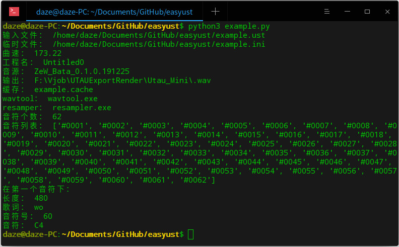
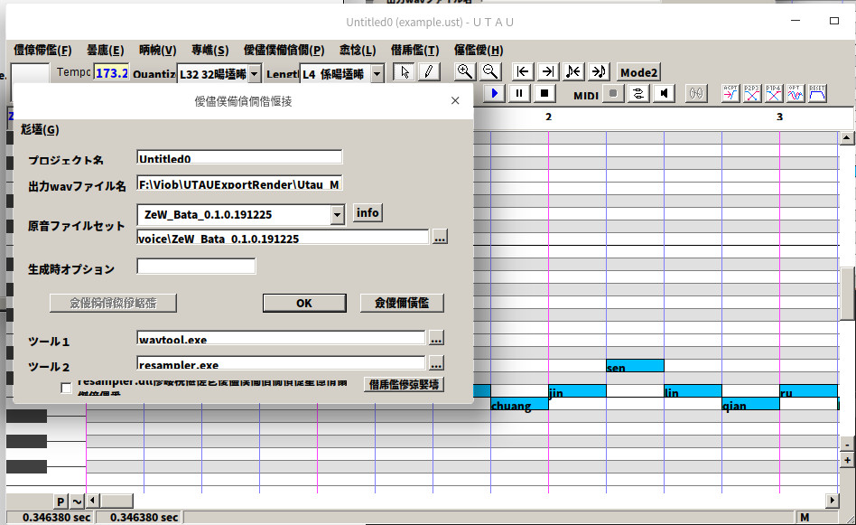

# easyust
Easy UST-一个适用于python的UST工程读取模块  
（未来会不会有Easy VSQx、Easy VPR和Easy s5p呢？）
## 快速开始
首先clone  
然后cd到easyust目录  
最后：`$ python3 example.py `  
  
显示成这样就说明你成功了！  
下一步：打开`example.py`，对着下面的函数列表研究一下每个函数怎么用
## 函数列表：
|函数|作用|用法|说明|返回值|
|---|---|----|---|-----|
|getnote|将音符号转换为音符|easyust.getnote(音符号)|配合rNoteNum使用|字符串：音符（如C3）|
|cproject|转换工程为easyust工程|easyust.cproject('ust文件','输出')|旧版UST一定要转码，否则不识别，输出可以不要，默认为"当前工作目录/temp.ini"|元组：('ust文件', 'outfile')|
|rtempo|读取工程曲速|easyust.rtempo(easyust工程)|-|字符串：曲速值|
|rrpname|读取工程名称|easyust.rpname(easyust工程)|-|字符串：名称|
|rdb|读取工程使用的音源|easyust.rdb(easyust工程)|目前有严重BUG|字符串：音源|
|rof|读取工程的输出路径|easyust.rof(easyust工程)|目前有严重BUG|字符串：输出路径|
|rcache|读取工程的缓存文件夹|easyust.rcache(easyust工程)|目前有严重BUG|字符串：缓存文件夹（通常为xxx.cache|
|rwt|读取工程使用的wavtool|easyust.rwt(easyust工程)|-|字符串：wavtool（通常为xxx.exe）|
|rres|读取工程使用的resamper|easyust.rres(easyust工程)|-|字符串：resamper（通常为xxx.exe）|
|rflags|读取工程的Flags|easyust.rflags(easyust工程)|新版U可能已移除|字符串：Flags|
|rnallnote|读取工程的音符个数|easyust.rnallnote(easyust工程)|-|字符串：音符个数|
|rallnote|读取工程的所有音符，并列表|easyust.rallnote(easyust工程)|-|列表：音符列表|
|rlength|读取音符长度|easyust.rlength(easyust工程,音符编号)|-|字符串：长度|
|rlyric|读取歌词|easyust.rlyric(easyust工程,音符编号))|-|字符串：歌词|
|rNoteNum|读取音符号|easyust.rNoteNum(easyust工程,音符编号)|可配合getnote使用：easyust.getnote(easyust.rNoteNum(easyust工程,音符编号))|字符串：音符号（如60）

注：其实还有一堆隐藏函数，只是我也搞不懂这些函数有什么卵用，所以没把它放到文档里
## 示例
示例工程截图(请忽略乱码)：  
  
首先导入：`>>> import easyust`  
然后转码工程：`>>> easyust.cproject('example.ust','example.ini')`  
模块会返回一元组告诉你输入和输出文件的路径：`('/home/daze/Documents/GitHub/easyust/example.ust', '/home/daze/Documents/GitHub/easyust/example.ini')`  
最后我们就可以读取工程信息了：  
比如曲速：  
`>>> easyust.rtempo('example.ini')`  
`'173.22'`  
当然，支持的函数见函数列表
## 灵感
这货其实是[UCore](https://github.com/daze456/UCore)的附属产品，或者是我为了方便UTAUCore开发特意搞的模块。。。  
当然，本模块使用Apache License开源，意味着你可以闭源（我不想限制各位闭源的权利）